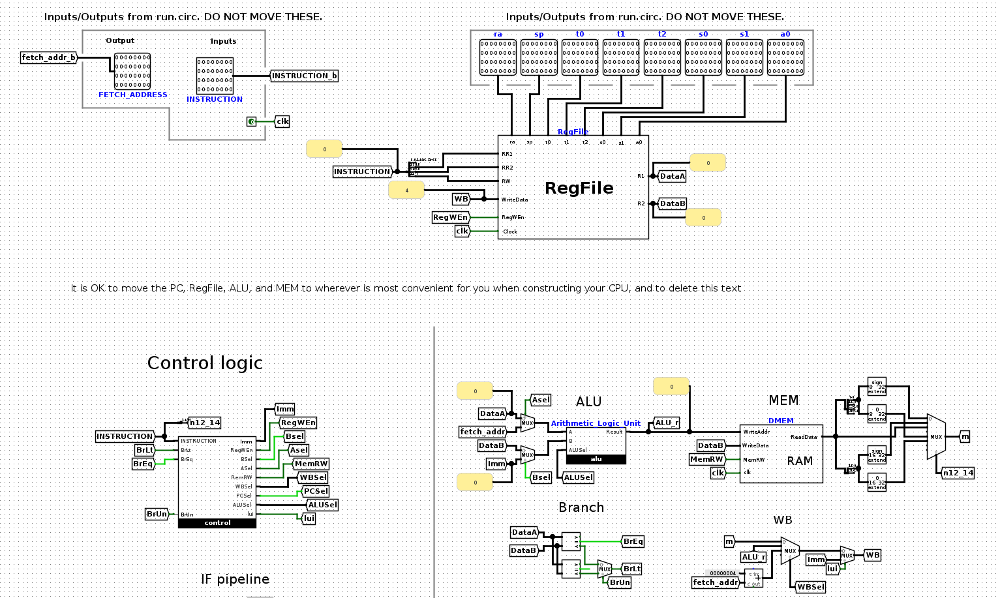

# CS110
上海科技大学计算机体系结构课程

This repository holds the semester-long effort of my excellent partner @huiwy and me. A detailed description of each homework, lab, project, and complimentary lecture and tutorial can be found on the [official course webpage](https://autolab.sist.shanghaitech.edu.cn/courses/ca/20s/).


## Projects
- Project 1
> In this project, you will create an emulator that can execute a subset of the RISC-V ISA. You'll provide the machinery to decode and execute a couple dozen RISC-V instructions. You're creating what is effectively a miniature version of VENUS!

- Project 2
> In project 2.1, you will use logisim-evolution to create an ALU that supports all the operations needed by the instructions in our ISA, and a RegFile, which should be able to write to or read from these registers specified in a given RISC-V instruction. In project 2.2, you will build upon the previous project and implement a 2 stage pipeline RISC-V(subset of RV32I) processor. Once you've completed this project, you'll know essentially everything you need to build a computer from scratch with nothing but transistors.

- Project 3
> In this project, we hope you can use all knowledge about computer architecture that you have learned in this course to optimize a very simple, yet slow program.
```C
void calc (int n, const int *a, const int *b, int *c) {
  for (int k = 0; k < n; k++)
    for (int i = 0; i < n - k; ++i)
      c[k] += a[i + k] * b[i];
}
```
The original code is given above, and our hand-optimized version can be found in [`calc.cpp`](project/p3_optimization/calc.cpp).
The final speedup is over **several hundred times**!.

- Project 4
> In this project, you will be implementing a Pong game using the Longan Nano development board we've given to you. We hope this project will help you experience programming RISC-V assembly on a real machine rather than in a simulator.

## Homeworks
There are 7 homeworks in total. Homework 1, 4, and 6 are written assignments, so you won't find them in this repository.

- Homework 2
> Implement a vector in C. See the header file [`vector.h`](homework/hw2_vector/vector.h) for details. Implement the code in a file called `vector.c`.

- Homework 3
> In this homework, you will write a program to generate a preorder traversal of a binary search tree from given inorder and postorder traversals using RISC-V. The template can be found in [`hw3_template.s`](homework/hw3_inorder/hw3_template.s).

- Homework 5
> In this homework, you will design a parallel single-source shortest path (parallel SSSP) algorithm and implement it using POSIX Threads. Many serial algorithms can solve this problem very efficiently. However, not all of them are good candidates for parallelization.
> You will be given a directed graph with positive edges. Your objective is to find the shortest path between two given vertices (source and target).

IO needs to be handled manually and is actually timed(WEIRD!).

- Homework 7
> Your task is to implement a vector in C++ using templates. Its behavior should be similar to the std::vector.

The problem description is actually quite vague, and the semantics of each function/operator is not defined clearly. Also, the TA responsible for this homework seems to have a strange obsession towards vectors, iterators, and OOP, which is not the focus of this course...

## Labs
- Lab 1
Environment setup and C programming.

- Lab 2
Intro to assembly with RISC-V simulator Venus

- Lab 3
Bit fiddling and Valgrind

- Lab 4
Functional call in RISC-V assembly

- Lab 5
Logisim and finite state machine

- Lab 6
Advanced Logisim

- Lab 7
Pipelining using registers

- Lab 8
Cache visualization and matrix multiplication optimization

- Lab 9
SIMD with Intel intrinsics

- Lab 10
Multi-threading programming using OpenMP

- Lab 11
Hello world with Longan Nano

- Lab 12
MapReduce using Spark

- Lab 13
Explore workings of virtual memory using CAMERA
